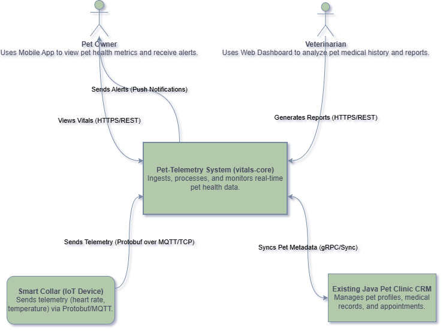
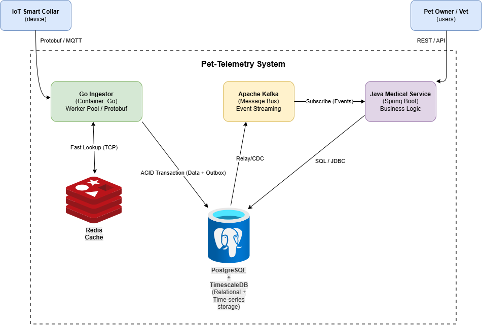
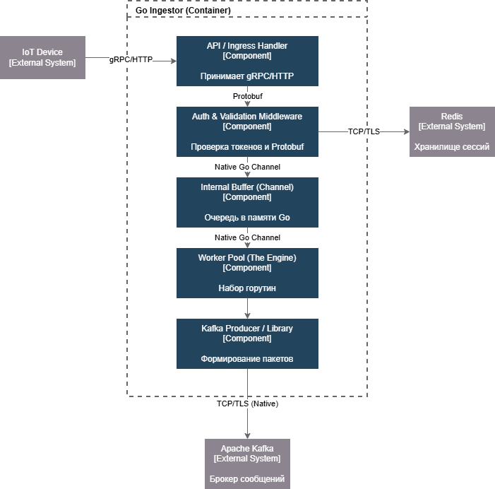

# 🐾 pet-telemetry: High-Load IoT Monitoring System

[](#)
[](#)

## 📌 Overview
**pet-telemetry** is a high-performance backend ecosystem designed to ingest, process, and analyze real-time health data (heart rate, temperature, activity) from thousands of IoT-enabled pet collars. Engineered to handle **2,000+ RPS (172M+ events per day)**.

---

## 🏗 Architecture & Visual Design (C4 Model)
Following the formal requirements, the design is presented through three levels of the C4 Model:

### 1. Context Diagram (Level 1)
*System boundaries and external actors.* 

### 2. Container Diagram (Level 2)
*Tech stack, Cloud services (AWS), and Scaling logic.* 

### 3. Component Diagram (Level 3)
*Internal logic of the Go Ingestor (Worker Pool and Buffering).* 

---

## 📁 Project Documentation

This index maps every technical document to the formal assignment requirements.

### 🏛 1. Core Architectural Requirements
* **Requirements Impact:** [Architectural Vision & Requirements Analysis](./docs/architecture-deep-dive.md)
* **High-Level Design:** [Architectural Style & Patterns](./docs/architectural-style.md)
* **Data Modeling:** [Storage Architecture & Database Schema](./docs/storage-architecture.md)
* **Storage Technical Analysis:**
    * [CAP & PACELC Strategy](./docs/cap-pacelc-analysis.md)
    * [Replication & Resilience Engineering](./docs/replication-strategies.md)
    * [Distributed Storage Specifications (Sharding/Consensus)](./docs/distributed-storage-specs.md)
    * [Distributed Consistency (Saga/Transactions)](./docs/distributed-consistency-and-transactions.md)
* **Low-Level Design (LLD):** [Go Ingestor Internal Engine & Lifecycle](./docs/low-level-design.md)
* **Metrics & Monitoring:** [Observability, SLIs, SLOs & Alerting](./docs/observability.md)

### 🧠 2. Deep-Dive Technical Research

* **Performance & Scale:**
    * [Capacity Planning (2k RPS Math)](./docs/capacity-planning.md)
    * [Scalability Analysis (Vertical & Horizontal)](./docs/scalability-analysis.md)
    * [CS Fundamentals (LSM-Trees, B-Trees, Memory)](./docs/data-structures-and-memory.md)

* **Service Decomposition & Data Optimization:**
    * [Decomposition Strategy (Scaling "In-Depth")](./docs/decomposition-strategy.md)
    * [Data Access Strategy (gRPC, MQTT, Kafka)](./docs/data-access-strategy.md)
    * [Data Serialization (Protobuf vs JSON Efficiency)](./docs/data-serialization-storage.md)
    * [Analytics & Reporting Strategy](./docs/analytics-and-reporting.md)

### 🎓 3. Final Summary
* [**Academic Reflection Report**](./docs/academic-reflection.md) – Project evolution and key engineering takeaways.

---

## 🏗 Data Contracts
Strict typing and efficient serialization via **Protocol Buffers**:
* **Contract Definition:** [api/telemetry.proto](./api/telemetry.proto)

---

## 🛠 Getting Started
```bash
cd deploy
docker-compose up -d

Infrastructure Map:

TimescaleDB: 5432 | PostgreSQL: 5433 | Kafka: 9092 | Redis: 6379

Developed as part of the Advanced Software Architecture Program, 2026.